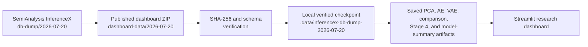
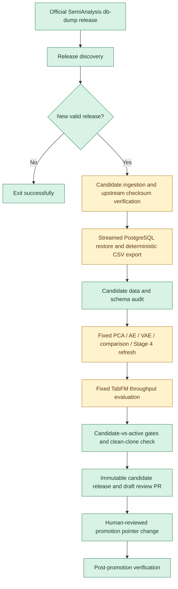

# InferenceX Representation & Performance Research

This repository analyzes benchmark data from [SemiAnalysis InferenceX](https://github.com/SemiAnalysisAI/InferenceX-app): a record of how LLM-serving systems behave across model, hardware, framework, precision, workload, concurrency, parallelism, disaggregation, multinode, and speculative-decoding choices.

It combines two complementary lines of work. First, it maps the structure of serving configurations with PCA, an autoencoder (AE), and a variational autoencoder (VAE). Second, it preserves supervised research on throughput prediction with grouped, unseen-configuration validation. The result is a Streamlit research dashboard backed by a frozen, verified data checkpoint and matching research artifacts.

This is an analysis and reproducibility project, not a production inference-serving system or prediction API. It is designed to make the current evidence inspectable today while establishing a fail-closed path for evaluating later official InferenceX snapshots.

## Project Status

| Component | Status |
|---|---|
| Frozen July 20 dataset checkpoint | Complete |
| Clean-clone dashboard bootstrap | Complete |
| PCA research | Complete |
| AE/VAE representation research | Complete |
| Stage 4 methodological validation | Complete |
| TabFM throughput research | Complete, evaluation artifacts only |
| Observed energy explorer | Complete |
| CI and active-checkpoint reproducibility checks | Complete |
| Snapshot refresh orchestration | Implemented, resource-gated |
| Automated official-release discovery | Implemented |
| GitHub-hosted heavy refresh execution | Pending larger-runner integration and replay proof |
| Automatic promotion | Intentionally disabled |
| Human-reviewed promotion | Implemented as an explicit pointer-change flow |
| TabFM serving API/product | Future work |

The active dashboard remains pinned to the immutable July checkpoint. New upstream data is never promoted automatically.

## Why It Matters

Inference performance is shaped by interacting system choices, not just a model name or accelerator. Framework behavior, precision, request length, concurrency, parallelism, worker allocation, disaggregation, multinode topology, and speculative decoding can move latency, throughput, and energy together or in tension. Exhaustively benchmarking every combination is impractical, so the project makes observed coverage visible, identifies stable structure in the configuration space, and evaluates generalization only across configurations held out as groups.

## What the Project Does

The dashboard makes the benchmark data and completed research legible without requiring a PostgreSQL restore or model training on a user's machine. It includes:

- **Overview and data understanding** for coverage, missingness, distributions, and configuration/workload composition.
- **Representation analysis** for a shared PCA basis, final AE and VAE artifacts, cross-method comparison, and Stage 4 validation evidence.
- **Model results** for the preserved grouped TabFM throughput research and its research-only uncertainty diagnostics.
- **Observed energy measurements** for exact measured energy lookups and nearby measured comparisons. It does not estimate, impute, or extrapolate energy.

The central research question is not simply which configuration is fastest. It is how serving choices jointly organize the observed benchmark space, which structure is stable and interpretable, and how well a fixed supervised protocol generalizes to configurations it did not see during evaluation.

## Architecture

### Normal dashboard use — implemented



### Future snapshot refresh — orchestration implemented; heavy execution pending hosted-runner proof



The pending portion is intentional: the expensive path still expects dedicated runner resources and an approved TabFM environment. It has not yet been proven end-to-end on a GitHub-hosted larger runner, so automated expensive refresh remains disabled.

## Dataset

The active source is the official [SemiAnalysisAI/InferenceX-app `db-dump/2026-07-20` release](https://github.com/SemiAnalysisAI/InferenceX-app/releases/tag/db-dump/2026-07-20).

| Property | Active value |
|---|---|
| Dataset ID | `inferencex-db-dump-2026-07-20` |
| Dashboard data release | [`dashboard-data/2026-07-20`](https://github.com/MQubeAI/InferenceX-PCA-demo/releases/tag/dashboard-data/2026-07-20) |
| Raw benchmark rows | 81,851 |
| Physical rows in `configs.csv` | 1,935 |
| Configurations referenced by benchmark rows | 1,368 |
| Median config/workload/concurrency groups | 8,239 |
| Canonical `single_turn` PCA/representation cohort | 8,063 groups |
| Eligible PCA configurations | 1,354 |

`configs.csv` is a physical table export, so its 1,935 rows include configurations that are not referenced by a benchmark row in this checkpoint. The 1,368 benchmark-referenced configurations are the configurations that resolve through the benchmark-to-config join; the PCA/representation cohort then applies its workload and feature-eligibility rules to that joined data.

The repository distributes a small dashboard-oriented ZIP containing only `benchmark_results_raw.csv` and `configs.csv`. This lets normal users inspect the frozen checkpoint without downloading or restoring the multi-gigabyte upstream PostgreSQL dump.

For the complete July refresh methodology and coverage discussion, see [the PCA refresh report](reports/july_2026_pca_refresh.md).

## Quick Start

Install CPython 3.11, then run:

```bash
git clone https://github.com/MQubeAI/InferenceX-PCA-demo.git
cd InferenceX-PCA-demo
./run_dashboard.sh
```

On first run, the launcher creates a dashboard environment, installs the locked runtime, downloads the published data bundle, verifies it, installs it atomically under `.data/`, validates the matching research-artifact set, and starts Streamlit. PostgreSQL, Docker, the upstream dump, and a TabFM environment are not required for normal dashboard use.

The normal local location is:

```text
.data/inferencex-db-dump-2026-07-20/
├── benchmark_results_raw.csv
└── configs.csv
```

`.data/` is ignored by Git. Removing that directory and rerunning the launcher performs a clean data bootstrap. `INFERENCEX_DATA_DIR` is an advanced developer override; custom, legacy flattened, and JSON inputs are visibly identified and do not receive verified July artifact overlays.

## Reproducibility and Data Integrity

The active checkpoint is a contract, not just a pair of CSV files. The bootstrap and runtime checks verify:

- the ZIP archive SHA-256;
- each CSV's full SHA-256 and expected byte size;
- required CSV columns and row counts;
- the active dataset ID and official source release;
- the active artifact pointer and artifact source compatibility; and
- canonical cohort identity before representation companions are displayed.

The contracts live in [data-manifest.json](data-manifest.json), the versioned [July manifest](data/manifests/2026-07-20.json), and [data/artifact-index.json](data/artifact-index.json). The CI workflow starts without local data, bootstraps the active release, runs unit and semantic tests, validates the July audit fixture, and requires a Streamlit AppTest plus a healthy headless server.

### Order-independent semantic identity

Recovery of the official July dump exposed an important reproducibility issue: PostgreSQL/export row order differed even though the data itself was the same. The project now treats `config_id`, `benchmark_type`, `isl`, `osl`, and `conc` as the aggregate row identity rather than treating dataframe position as identity.

The July semantic audit established that all 8,063 cohort row IDs matched the committed AE/VAE companions, with no missing, extra, or duplicate IDs. PCA source inputs were equal by row identity, and median TPOT, throughput per GPU, and observed energy targets matched by row identity. Existing historical artifacts were preserved; they were not retrained merely to reproduce an export order. At runtime, saved embedding companions are aligned by `row_id`, never by dataframe index.

## Representation Research

All three representation methods use the same frozen input contract: 19 configuration and workload fields, with outcomes excluded from fitting. The common cohort contains 8,063 eligible `single_turn` aggregate groups across 1,354 configurations. Validation holds out complete `config_id` groups.

### PCA: interpretation-first structure

The shared July PCA basis describes configuration and workload variation; latency, throughput, power, and energy are overlays rather than inputs. The first five components explain 64.37% of encoded variance. The strongest structural directions are stable against the prior snapshot, while component associations with outcomes are descriptive—not causal predictions.

PCA is the clearest method for inspecting signed feature loadings, global directions, and temporal basis stability. It is the dashboard's interpretation-first representation.

### AE and VAE: bounded nonlinear comparisons

The final AE and VAE use the fixed 51-dimensional encoded input matrix, a 15-dimensional latent space, three grouped `config_id` folds, and seeds 42, 123, and 2026. The AE achieved the strongest matched reconstruction result (validation MSE `0.012460 ± 0.003290`), supporting nonlinear deterministic structure in the configuration space.

The VAE is retained as a bounded regularized baseline, not a universal winner. Its fixed beta-0.1 variant improves substantially over beta 1.0 but still shows partial latent-dimension use and weaker matched reconstruction than the AE. The final comparison does not claim that a two-dimensional visualization, a clustering score, or one outcome probe establishes general superiority.

### Stage 4 validation

Stage 4 is methodological validation, not another architecture search. It checks leakage-safe fold-local preprocessing, independent grouped partitions, source-balanced reconstruction, bounded robustness interventions, feature-consistency evidence, cross-method clustering agreement, and feature-family ablations. It preserves the Stage 3 artifacts and concludes that AE reconstruction strength and PCA interpretability remain evidence-specific findings. External-snapshot validation is still planned, not completed.

Detailed methodology and results are available in the [protocol](reports/representation_analysis_protocol.md), [Stage 3 report](reports/representation_analysis_stage3.md), [Stage 4 report](reports/representation_analysis_stage4.md), and committed artifact metadata under `artifacts/`.

## Supervised Throughput Research

The selected supervised research result is **full-context TabFM** for raw `metrics_tput_per_gpu`, evaluated with three grouped unseen-`config_id` folds. The preserved result uses 4,096 sampled aggregate rows and reports:

| Metric | Result |
|---|---:|
| Grouped R² | `0.961979 ± 0.008605` |
| MAE | `338.540384` tokens/s/GPU |

TabFM was selected because throughput was the strongest measured target in the screening evidence and the fixed full-context grouped evaluation produced the strongest preserved result. This is not a claim that it beat every possible model under an identical final experiment: an exactly matched final Random Forest comparison was not preserved.

The dashboard reads aggregate research results only. It does not load a TabFM serving checkpoint, run TabFM, apply historical predictions to July rows, or offer a production prediction service. The historical supervised artifacts are target-selection context; they were not retrained on the cumulative July checkpoint.

### Uncertainty and latency scope

Conditional-scale split conformal is the selected **research-only** uncertainty method for throughput. At nominal 95% coverage, the recorded experiment achieved 95.34% empirical coverage with an average interval width of 2,485.442 tokens/s/GPU. Its point model used reduced context to reserve separate uncertainty-training and calibration data, so it must not replace or be presented as calibrated around the selected full-context TabFM result.

Median-TPOT tail segmentation and residual-model variants did not consistently improve the global baseline. They remain historical negative evidence rather than an active product feature. See [the model decision record](docs/model-research-conclusion.md), [central model-selection diagnostic](docs/central-model-selection.md), and [throughput uncertainty notes](docs/throughput-uncertainty.md).

## Observed Energy Analysis

Energy is presented as observed measurement data, not a modeled target. The July checkpoint contains 5,175 usable raw energy rows, aggregating to 2,766 groups across 305 of 1,368 benchmark-referenced configurations.

The dashboard's Energy Measurements explorer performs exact measured configuration/workload lookups, reports observed medians and ranges, and can show nearby measured comparisons. Electricity cost conversions are arithmetic transformations of observed energy values, not new measurements or predictions.

Energy modeling is deliberately out of scope today. The measured subset has narrow workload, category, and time coverage, and individual dump rows do not pin a metric-code version. The project will not extrapolate energy until coverage supports a separately approved grouped and temporal validation design.

## Snapshot Refresh Lifecycle

The refresh system separates discovery, candidate construction, validation, review, and promotion:

1. A lightweight GitHub Actions workflow checks only official, non-draft, non-prerelease `db-dump/YYYY-MM-DD` releases from `SemiAnalysisAI/InferenceX-app` on Monday, Wednesday, and Friday.
2. A genuinely newer release may enter a **candidate-only** ingestion path. Upstream checksums are verified before restore; dump parts stream through Zstandard into a selective PostgreSQL 17 restore, with no full decompressed archive written to disk.
3. Candidate CSVs are exported in deterministic primary-key order, audited against the active checkpoint, and packaged with recorded hashes.
4. The fixed PCA, AE, VAE, comparison, Stage 4, TabFM, uncertainty, policy, and clean-clone gates must complete before a candidate release and draft review PR can be created.
5. A human-reviewed promotion change is the only mechanism that may update `data-manifest.json` and the active artifact pointer. A rollback is the same explicit pointer operation to a prior promoted snapshot; it never mutates an old release.

The implementation is fail-closed: invalid checksums, schema incompatibility, broken joins, invalid metrics, leakage, missing research gates, non-finite outputs, or a failed clean-clone check leave the active checkpoint untouched.

### What is still pending

The orchestration is checked in, but its heavyweight candidate and July replay workflows currently require a dedicated resource runner and an approved external TabFM command. The planned GitHub-hosted larger-runner integration has not been completed or proven with a real July replay. Therefore `INFERENCEX_AUTOMATED_REFRESH_ENABLED` remains false, no new snapshot is automatically processed, and no snapshot can auto-promote.

Maintainers should use [the refresh operations guide](docs/future-automated-snapshot-refresh.md) for the current contract, failure handling, candidate review, promotion, and rollback details.

## Historical Research vs. Active Product Behavior

| Area | Active dashboard behavior | Historical research record |
|---|---|---|
| PCA | Loads the committed July PCA artifact and overlays observed outcomes | The basis was built from the cumulative July cohort |
| AE/VAE | Loads compatible embeddings and metadata by `row_id` | Fixed grouped, multi-seed representation experiments |
| TabFM | Displays aggregate result and uncertainty summaries | Throughput evaluation only; no serving checkpoint |
| Energy | Shows exact observations and nearby observed comparisons | No energy model was trained or loaded |
| Snapshot refresh | Uses the active promoted manifest | Candidate orchestration exists but heavy hosted execution remains pending |

## Limitations

- This is observational analysis. It identifies patterns in benchmark coverage; it does not establish causality or prescribe an optimal serving configuration.
- Coverage is uneven across workloads, models, hardware, frameworks, and serving topologies. Grouped `config_id` validation protects against a key form of leakage but does not eliminate distribution shift.
- PCA depends on encoding and the chosen aggregation unit. Its outcomes are overlays, not fitted inputs.
- AE reconstruction quality, PCA interpretability, and VAE regularization answer different questions; there is no universal representation winner.
- VAE retains partial posterior-collapse limitations, and no untouched external snapshot has yet validated neural stability.
- The selected TabFM result is a research evaluation artifact, not an operational predictor or calibrated production uncertainty service.
- Energy coverage remains too narrow for credible general energy prediction.
- Automated release discovery is available, but the heavy refresh path is not yet proven on GitHub-hosted larger runners.

## Where the Project Can Go Next

- Complete and validate the GitHub-hosted larger-runner implementation for PostgreSQL recovery, fixed representation refresh, and the approved TabFM protocol.
- Use the next untouched official snapshot for prospective external validation.
- Expand benchmark coverage and evaluate configuration ranking, regret, and coverage-gap analyses.
- Revisit energy modeling only after broader workload, category, and temporal support permits robust validation.
- Treat any TabFM serving API, persistent checkpoint, or recommendation product as a separate, explicitly scoped engineering and research decision.

## Further Reading

- [July 2026 PCA refresh report](reports/july_2026_pca_refresh.md)
- [Representation analysis protocol](reports/representation_analysis_protocol.md)
- [Stage 2 representation screen](reports/representation_analysis_stage2.md)
- [Stage 3 final representation evidence](reports/representation_analysis_stage3.md)
- [Stage 4 methodological validation](reports/representation_analysis_stage4.md)
- [Model research conclusion](docs/model-research-conclusion.md)
- [Automated snapshot refresh operations](docs/future-automated-snapshot-refresh.md)
- [Active checkpoint manifest](data-manifest.json)

## Data and Repository Safety

Do not commit `.data/`, upstream dump parts, database clusters, generated CSV checkpoints, local environments, logs, or secrets. The checked-in project contains manifests and research artifacts; normal users obtain the verified dashboard CSV bundle from the pinned release.
