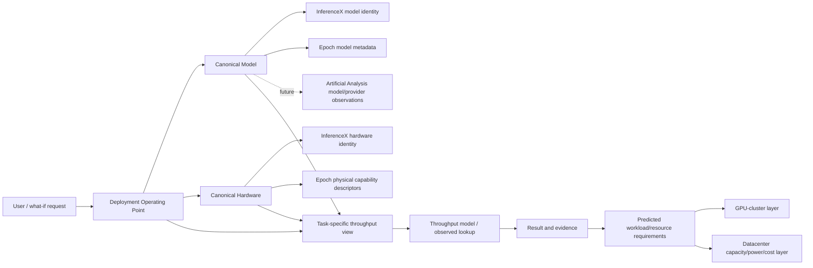

# Worked multi-source prototype

The prototype is an additive section in the existing **Model Results** dashboard
tab. It loads the prebuilt derived view and performs no model fitting or model
runtime loading in Streamlit.

It lets a user filter an observed operating point by model, hardware,
framework, ISL, OSL, concurrency, precision, and major TP/EP values, then
select an exact aggregate operating point. It prominently displays the exact
observed InferenceX throughput, configuration fields, and Epoch hardware
descriptors. H100/H200 show an unresolved mapping warning rather than borrowed
specifications. Artificial Analysis absence is visibly non-fatal.

For a hardware what-if, it holds all stored structural configuration fields
constant and searches for an exact measured InferenceX counterpart. A real
counterpart is labeled **Observed**. Otherwise it is labeled **Unsupported**:
the historical TabFM result is aggregate-only and not a reusable arbitrary
prediction service. The UI does not emit a fabricated prediction or attach an
interval calibrated around another point model. It also lists descriptive nearby
measured analogues using original workload/configuration mixed distance, never
UMAP/t-SNE coordinates or outcome values as inputs.

The dashed edge is a future source-specific observation path. GPU clusters and
datacenters only appear after workload/resource requirements; they do not feed
directly into the operating-point throughput model.

## Validated what-if boundary

The controlled Epoch validation supports descriptive hardware enrichment and
held-out-SKU research evidence only. It does not add an app prediction runtime:
the historical TabFM result is still aggregate-only, and transfer accuracy is
uneven across observed SKUs. The prototype therefore continues to show an exact
counterpart as **Observed** and any non-exact request as **Unsupported** until a
separately packaged point model and an explicit support/abstention policy are
validated. Artificial Analysis remains the next model-side source in the
dashed future branch; it is not loaded or used here.

The generated machine-readable prototype contract is
`data/derived/integration/prototypes/prototype_manifest.json`.
